# Telegram AI Scheduler Bot - Technical Overview 🏗️

## Project Summary

An intelligent Telegram bot that revolutionizes tutoring appointment management through AI-powered natural language processing. Built with Node.js and OpenAI GPT-4, the system understands conversational Hebrew and English to provide seamless lesson scheduling, student management, and business automation.

## 🧠 AI Agent - The Core Innovation

### What Makes It Special
The **AI Agent** (`src/ai/scheduler.js`) is the system's brain that transforms casual conversation into structured actions:

```javascript
// Natural Language → Structured Intent
"אני רוצה שיעור מחר בשעה 3" → {
  intent: "book_lesson",
  datetime: "2024-01-15T15:00:00",
  confidence: 0.95,
  natural_response: "מצוין! אני אבדוק זמינות עבורך למחר ב-15:00"
}
```

### Technical Implementation
- **Model**: OpenAI GPT-4 Turbo with custom Hebrew prompt engineering
- **Fallback System**: Rule-based NLP when AI is unavailable
- **Confidence Scoring**: Self-evaluation prevents misinterpretation
- **Context Awareness**: Maintains conversation state and history

### Intent Classification
| Intent | Description | Example |
|--------|-------------|---------|
| `book_lesson` | Schedule new lesson | "רוצה שיעור מחר" |
| `cancel_lesson` | Cancel existing lesson | "לבטל את השיעור" |
| `reschedule_lesson` | Move lesson time | "להעביר לזמן אחר" |
| `check_availability` | Show available slots | "מה פנוי השבוע?" |
| `join_waitlist` | Add to waiting list | "רשימת המתנה" |

## 🏗️ System Architecture

### High-Level Components


### Core Services

#### 1. AI Processing Layer (`src/ai/`)
- **Natural Language Understanding**: Converts text to structured intents
- **Context Management**: Maintains conversation flow
- **Response Generation**: Creates natural Hebrew/English responses

#### 2. Bot Interface (`src/bot/`)
- **Command Handlers**: `/start`, `/book`, `/cancel`, etc.
- **Message Processing**: Free-form text understanding
- **Callback Management**: Button interactions and confirmations

#### 3. Business Logic (`src/services/`)
- **Scheduler Service**: Core appointment logic
- **Calendar Integration**: Google Calendar synchronization  
- **Notification System**: Automated reminders and alerts

#### 4. Data Layer (`src/models/`)
- **Students**: Profile management and preferences
- **Lessons**: Appointment tracking and history
- **Waitlist**: Queue management with priorities
- **Notifications**: Message history and delivery tracking

## 🔄 User Journey Flow

### Typical Lesson Booking Flow

```mermaid
sequenceDiagram
    participant S as Student
    participant B as Bot
    participant AI as AI Agent
    participant DB as Database
    participant GC as Google Calendar
    
    S->>B: "אני רוצה שיעור מחר בשעה 3"
    B->>AI: Process natural language
    AI->>B: Intent: book_lesson, datetime: tomorrow 15:00
    B->>DB: Check teacher availability
    DB->>B: Available slots
    B->>GC: Check calendar conflicts
    GC->>B: No conflicts
    B->>DB: Create lesson booking
    B->>S: "הדרשתי והשיעור שתיזכה למחר ב-15:00"
    B->>GC: Add calendar event
```



## 🗃️ Database Schema

### Core Entities

```sql
-- Students: User profiles and preferences
Students {
  id: INTEGER PRIMARY KEY
  telegram_id: BIGINT UNIQUE
  first_name: VARCHAR(100)
  phone: VARCHAR(20)
  timezone: VARCHAR(50) DEFAULT 'Asia/Jerusalem'
  preferred_lesson_duration: INTEGER DEFAULT 60
  total_lessons_booked: INTEGER DEFAULT 0
}

-- Lessons: Appointment records
Lessons {
  id: INTEGER PRIMARY KEY
  student_id: INTEGER → Students(id)
  start_time: DATETIME
  end_time: DATETIME
  status: ENUM('scheduled', 'completed', 'cancelled')
  google_calendar_event_id: VARCHAR(255)
  subject: VARCHAR(100) DEFAULT 'Math'
}

-- Waitlist: Queue management
Waitlist {
  id: INTEGER PRIMARY KEY
  student_id: INTEGER → Students(id)
  preferred_start_time: DATETIME
  position: INTEGER
  urgency_level: ENUM('low', 'medium', 'high', 'urgent')
}
```

## 🔧 Configuration Management

### Environment-Based Configuration
```javascript
// src/config/settings.js
const settings = {
  teacher: {
    name: 'שפיר',
    timezone: 'Asia/Jerusalem',
    email: 'shafshaf6@gmail.com'
  },
  businessHours: {
    start: '10:00',
    end: '19:00',
    days: ['ראשון', 'שני', 'שלישי', 'רביעי', 'חמישי']
  },
  ai: {
    model: 'gpt-4-turbo-preview',
    maxTokens: 500,
    temperature: 0.7
  }
}
```

### Feature Flags
- **AI Processing**: Can fallback to rule-based when OpenAI unavailable
- **Calendar Integration**: Optional Google Calendar sync
- **Notifications**: Configurable reminder timing
- **Multi-language**: Hebrew primary, English secondary

## 🚀 Deployment Architecture

### Production Stack (Render.com)
```yaml
# render.yaml
services:
  - type: web
    name: math-tutor-bot
    env: node
    plan: free
    buildCommand: npm ci && npm run validate
    startCommand: npm start
    healthCheckPath: /health
```

### Infrastructure Components
- **Web Service**: Node.js Express server
- **Database**: SQLite (development) / PostgreSQL (production)
- **File Storage**: Local filesystem for logs and temporary files
- **External APIs**: Telegram Bot API, OpenAI API, Google Calendar API

### Monitoring & Observability
- **Health Checks**: `/health` endpoint with service status
- **Structured Logging**: Winston with JSON format
- **Error Tracking**: Comprehensive error logging and reporting
- **Performance Metrics**: Response times and API usage tracking

## 🔒 Security & Privacy

### Data Protection
- **Input Sanitization**: All user inputs validated and sanitized
- **Rate Limiting**: Protection against spam and abuse
- **Session Management**: Secure session handling with automatic cleanup
- **Error Handling**: No sensitive data in error responses

### API Security
- **Environment Variables**: All secrets in environment configuration
- **Request Validation**: Schema validation for all API endpoints
- **HTTPS Only**: Secure communication in production
- **Token Rotation**: Support for API key rotation

## 🧪 Testing Strategy

### Test Coverage
```bash
# Test suites available
npm test                    # All tests
npm run test:unit          # Unit tests only
npm run test:integration   # Integration tests
npm run test:ai            # AI processing tests
```

### Test Categories
- **AI Processing**: Natural language understanding accuracy
- **Business Logic**: Scheduling algorithms and conflict detection
- **Database Operations**: CRUD operations and data integrity
- **API Endpoints**: REST API functionality
- **Integration**: End-to-end user journeys

## 📈 Performance Characteristics

### Response Times (Target)
- **Simple Commands**: < 500ms
- **AI Processing**: < 3 seconds
- **Calendar Sync**: < 2 seconds
- **Database Queries**: < 100ms

### Scalability Considerations
- **Concurrent Users**: Designed for 100+ simultaneous users
- **Message Throughput**: 1000+ messages per minute
- **Database Growth**: Efficient indexing for large datasets
- **Memory Usage**: Optimized for cloud hosting constraints

## 🔮 Future Enhancements

### Planned Features
- **Multi-teacher Support**: Expand beyond single teacher
- **Video Integration**: Zoom/Teams meeting automation
- **Payment Processing**: Automated billing and payments
- **Advanced Analytics**: Student progress tracking
- **Mobile App**: Native mobile application

### Technical Improvements
- **Redis Caching**: Session and frequent query caching
- **Microservices**: Break monolith into specialized services
- **Real-time Updates**: WebSocket support for live updates
- **Advanced AI**: Fine-tuned models for better Hebrew understanding

---

**Built for scale, designed for simplicity, powered by AI** 🚀 